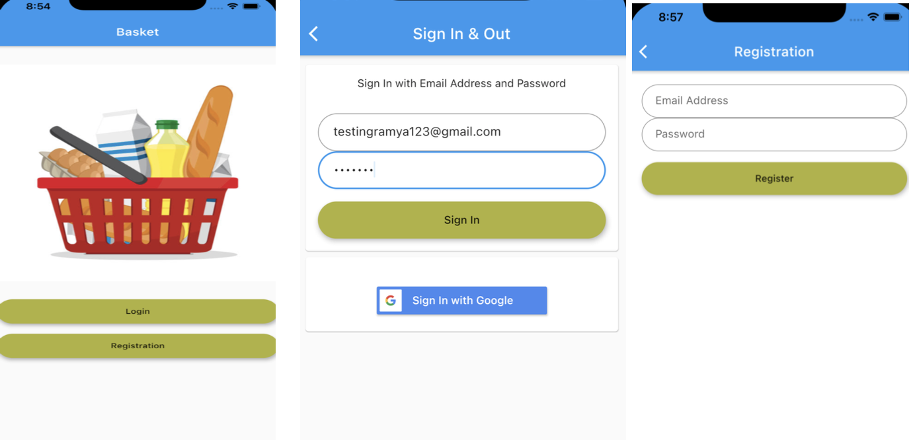
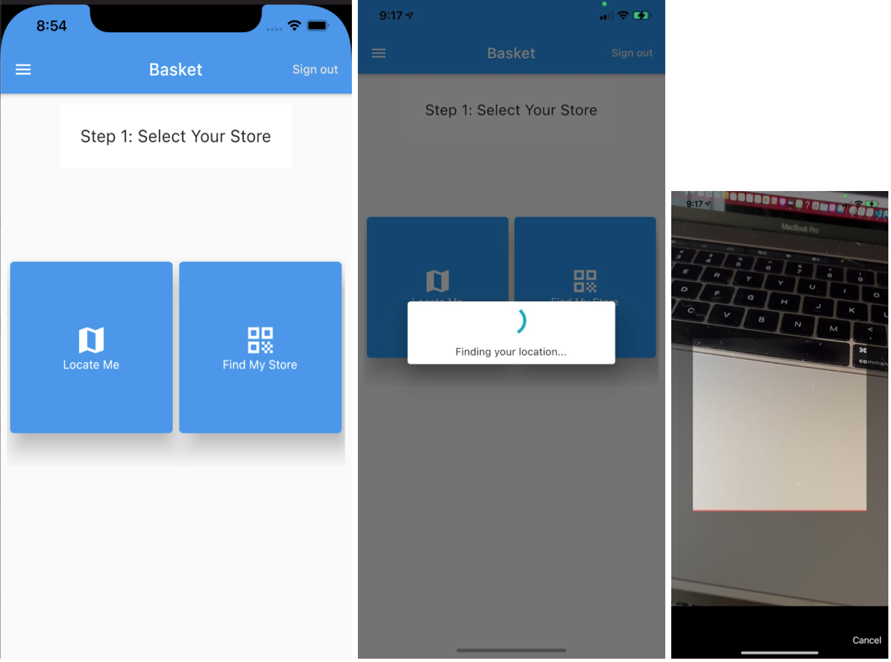
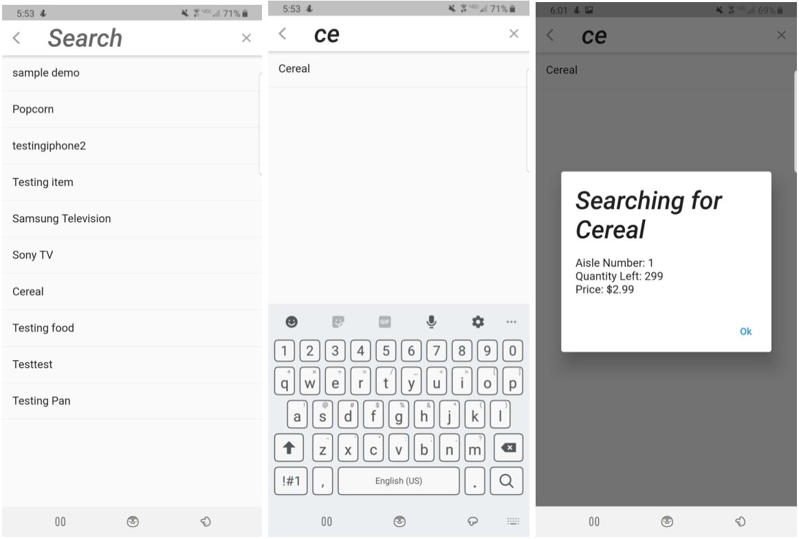
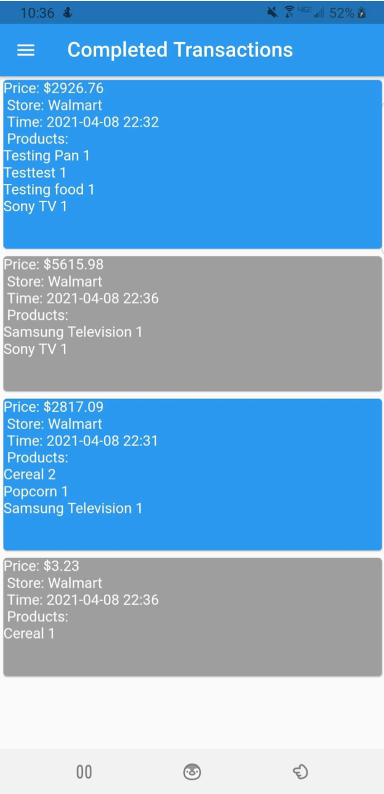
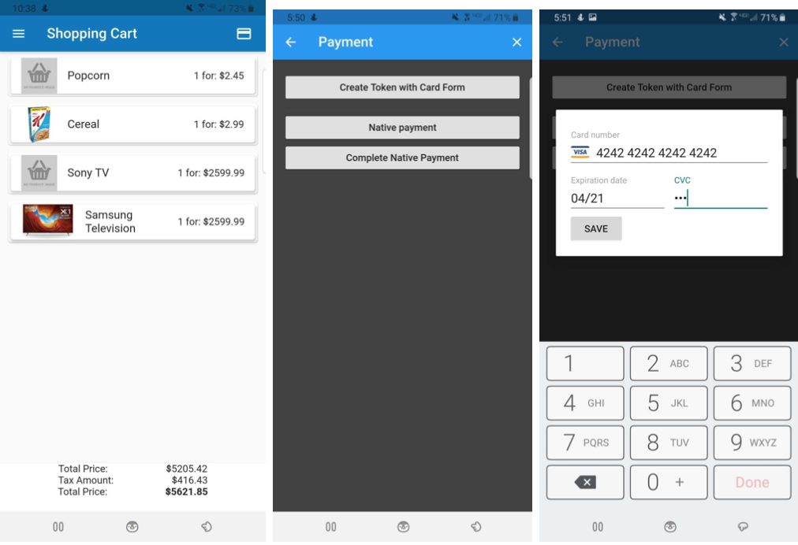

# Basket: A Contactless Shopping Experience 
## Customer's Mobile Application

#### To Run Code

Clone the repository and run in IDE of choice.  You might need to use a Dart plugin to run the code 

#### Project Features
* User registration
	
	
* Store selection

	

* Scan/Search products

	

* Transaction history

	
	
* Shopping cart functionality

	